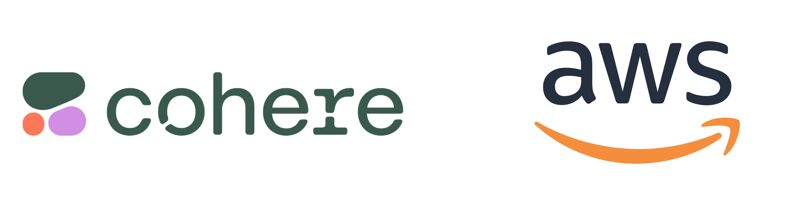

## Cohere on AWS examples

Welcome to the repository hosting example use of Cohere models on AWS! You will find a few folders within this repository that give various examples.
Open a PR if you would like to contribute! :twisted_rightwards_arrows:

## What's Available

**command-model:** This folder contains information and resources related to Cohere's command models, which are a type of large language model (LLM) designed to execute commands and perform specific tasks. It may include model architectures, training data, and documentation for developing and deploying command-based models.

**embed-model:** The embed-model stores resources and documentation for Cohere's embedding models. Embedding models are used to convert text into numerical representations, which can then be used for various natural language processing (NLP) tasks like text similarity, clustering, and more. This folder includes different methods to access the embedding models via AWS Bedrock and SageMaker.

**rerank-model:** Reranking models are essential for improving the relevance and quality of search results. The rerank-model folder contains resources and code for developing use cases that require improvement of the initial search results. 

**tool-use:** Tool-use is an important aspect of large language models, especially in the context of Cohere's Command models. This folder contains information and resources related to integrating and utilizing external tools within Cohere's models. It could include details on how to connect and interact with various APIs, databases, and other external resources to enhance the capabilities of Cohere's models.

**rag-receipes:** RAG, or Retrieval-Augmented Generation, is a technique where an LLM is augmented with the ability to retrieve and incorporate external information during the generation process. The rag-receipes folder contains different recipes or configurations for RAG, including various retrieval techniques, document stores, and methods for integrating external knowledge into the model's responses.

**workshop**: The [workshop](https://catalog.us-east-1.prod.workshops.aws/workshops/a7a3df78-086e-4159-8451-c1229e0f951e/en-US) folder is a central hub for collaborative projects between AWS and Cohere. It includes resources, documentation, and code for ongoing projects, as well as a knowledge base for best practices, guidelines, and tutorials for various AWS+Cohere architectures.

## Extra Resources 

### Cohere cookbooks and training
Cohere has consolidated and created a "cookbook" providing examples of using their models. Cohere's Cookbooks can be found here https://docs.cohere.com/page/cookbooks! This folder represents these cookbooks leveraging Bedrock APIs (Converse and Invoke_Model) to help customers become familiar with Bedrock APIs.

Learn more on Cohere's LLM university [https://cohere.com/llmu/#cohere-on-aws]

### AWS and Cohere blogs

[Run scalable, enterprise-grade generative AI workloads with Cohere Command R & R+, now available in Amazon Bedrock](https://aws.amazon.com/blogs/aws/run-scalable-enterprise-grade-generative-ai-workloads-with-cohere-r-r-now-available-in-amazon-bedrock/)

[Build enterprise-ready generative AI solutions with Cohere foundation models in Amazon Bedrock and Weaviate vector database on AWS Marketplace] (https://aws.amazon.com/blogs/machine-learning/build-enterprise-ready-generative-ai-solutions-with-cohere-foundation-models-in-amazon-bedrock-and-weaviate-vector-database-on-aws-marketplace/)

[Build financial search applications using the Amazon Bedrock Cohere multilingual embedding model](https://aws.amazon.com/blogs/machine-learning/build-financial-search-applications-using-the-amazon-bedrock-cohere-multilingual-embedding-model/)

### AWS Annoucements

[Command R and R+ on Amazon Bedrock](https://aws.amazon.com/about-aws/whats-new/2024/04/cohere-command-r-r-plus-amazon-bedrock/)

[Embed on Bedrock](https://aws.amazon.com/bedrock/cohere-command-embed/)

[Command R and R+ on SageMaker Jumpstart](https://aws.amazon.com/blogs/machine-learning/cohere-command-r-and-r-are-now-available-in-amazon-sagemaker-jumpstart/)

[Command R fine tuning](https://aws.amazon.com/blogs/machine-learning/amazon-sagemaker-unveils-the-cohere-command-r-fine-tuning-model/)

[Cohere Rerank3 Nimble on SageMaker jumpstart](https://aws.amazon.com/blogs/machine-learning/cohere-rerank-3-nimble-now-generally-available-on-amazon-sagemaker-jumpstart/)

[Command R 08-2024 fine tuning on SageMaker](https://cohere.com/blog/fine-tuning-command0824)

## Security

See [CONTRIBUTING](CONTRIBUTING.md#security-issue-notifications) for more information.

## Distributors

- AWS
- Cohere

## License

This library is licensed under the MIT-0 License. See the LICENSE file.

